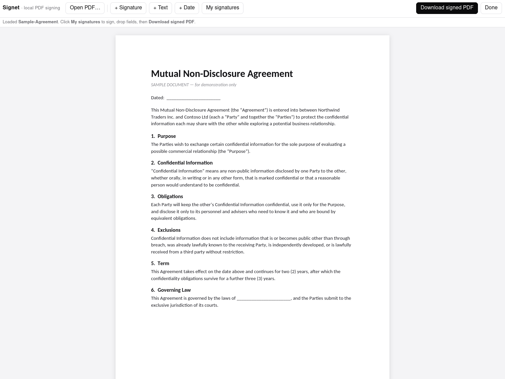
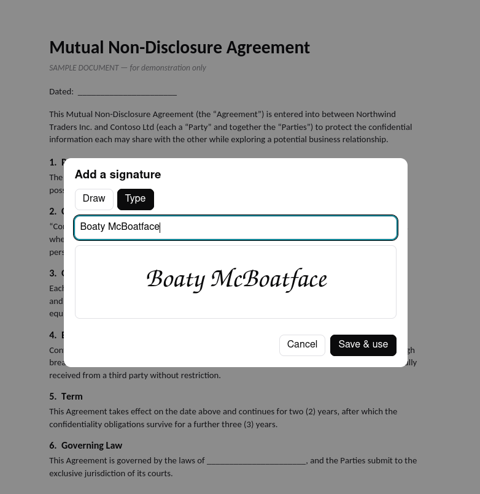
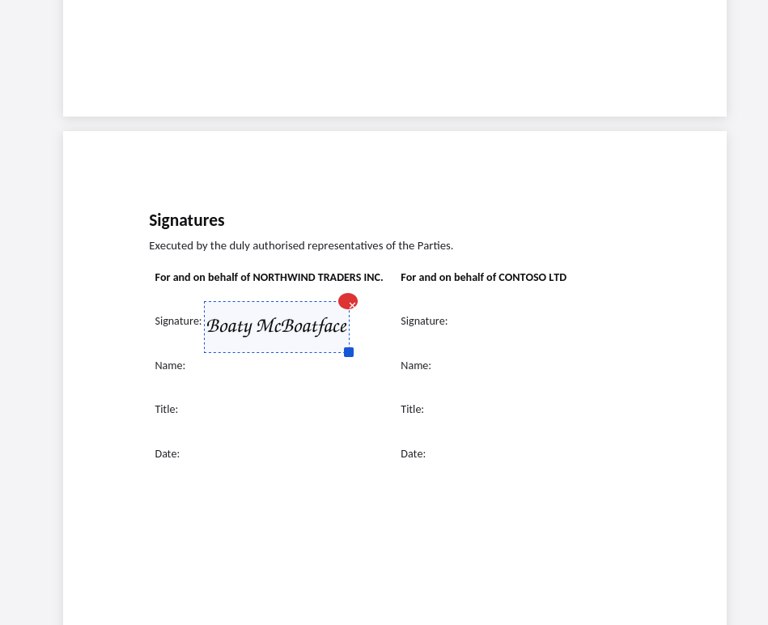

# Signet — local PDF signing

A tiny, fully-local PDF signer. Open a PDF, drop your signature (or a text/date
field), download the signed PDF. Your signature is saved in the browser for next
time. **Nothing leaves your machine** — no accounts, no uploads, works offline
(the PDF libraries are vendored in `vendor/`).

A one-file, self-hosted alternative to DocuSign / Dropbox Sign for the common
case: *"I just need to sign this PDF and send it back."*

## Install

### Arch Linux / EndeavourOS (AUR)
```
yay -S signet-pdf      # or: paru -S signet-pdf
```
(The AUR package is `signet-pdf` — plain `signet` is already taken by an unrelated project.)

### Any Linux (from source)
```
git clone https://github.com/matt-shearing/signet
cd signet
sudo make install      # system-wide (/usr/local), or…
./install.sh           # per-user, no root (~/.local)
```
Uninstall: `sudo make uninstall` (or `./uninstall.sh` for a per-user install).

Then **right-click any PDF → Open With → Signet** — it opens straight into the
signing view with the document loaded.

**Firefox** gets a true **no-server** experience: the PDF is embedded into a
throwaway folder and opened via `file://`, nothing listens on any port. **Chrome**
and others use a tiny loopback server that runs *only while you're signing* and
shuts down when you click **Done** (Chrome blocks `file://` workers). Force a mode
with `SIGNET_MODE=file` or `SIGNET_MODE=server`.

### Run ad-hoc (no install / for hacking on it)
```
python3 signet.py sample/Sample-Agreement.pdf   # try it on the included demo doc
./sign.sh                      # or serve at http://localhost:8000
```

## Use it
1. **My signatures** (or **+ Signature**) — draw or type your signature once; saved for reuse.
2. **+ Signature / + Text / + Date**, then click the page to drop the field. Drag to
   move, corner to resize, ✕ / `Del` to remove. Text & date fields are editable.
3. **Download signed PDF** → `<name>-SIGNED.pdf`. **Done** closes the session.

## Screenshots

Open a PDF — it loads straight into the signing view:



Create your signature once (draw or type) — it's saved for next time:



Drop it on the page, drag / resize to fit, then download the signed PDF:



_(Try it on the included `sample/Sample-Agreement.pdf`.)_

## How it works
Single HTML page + three vendored, open-source libraries:
[pdf.js](https://mozilla.github.io/pdf.js/) (Apache-2.0) to render,
[pdf-lib](https://pdflib.js.org/) (MIT) to stamp/flatten, and
[signature_pad](https://github.com/szimek/signature_pad) (MIT) to draw. The
`signet.py` launcher wires "Open With" to the browser. No build step. Packaging
lives in `packaging/` (`Makefile` + AUR `PKGBUILD`).

## Licence
MIT — see `LICENSE`.
